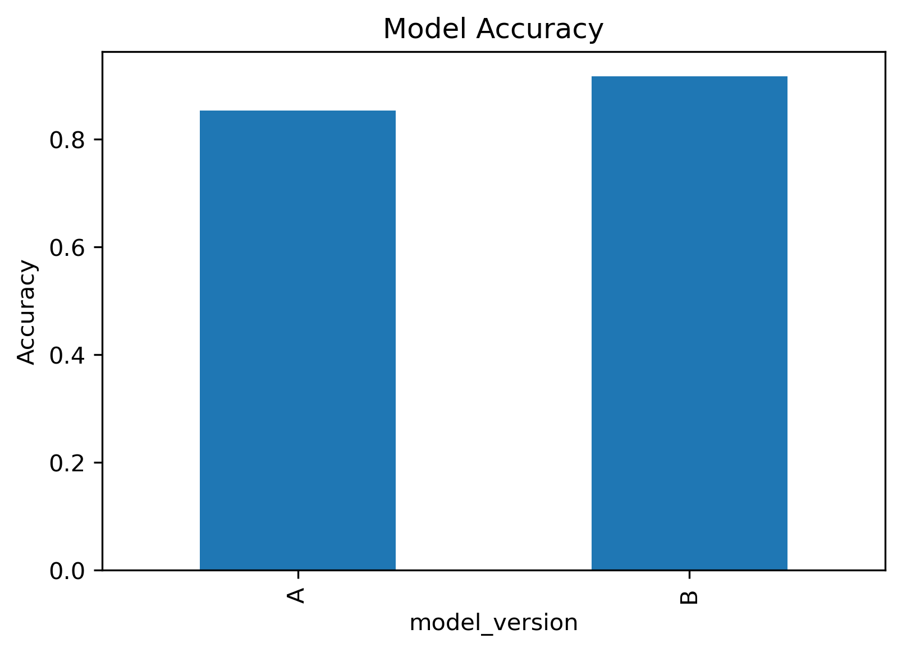
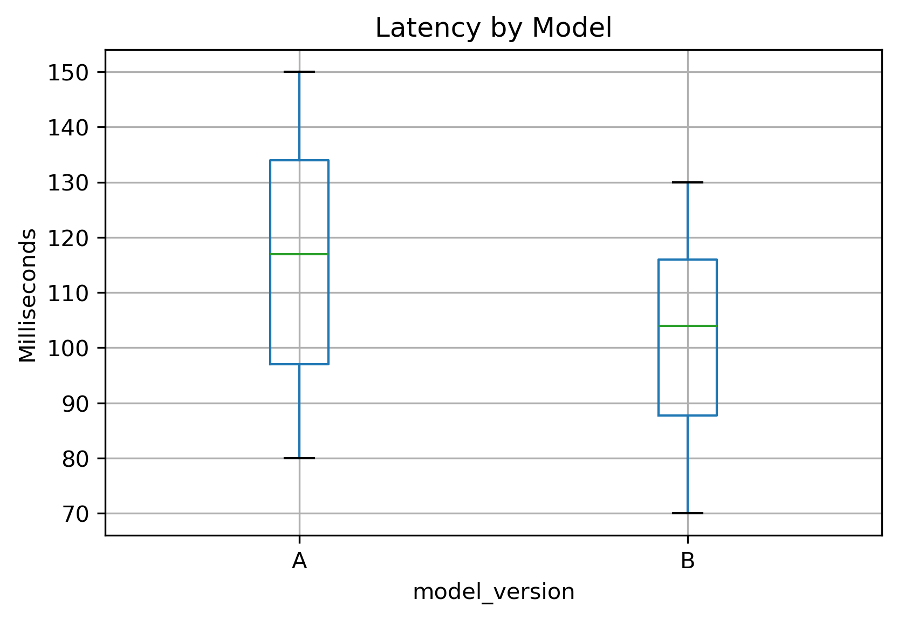

# A/B Testing Framework for ML Model Comparison

This project simulates an A/B test between two machine learning models (Model A vs Model B) to evaluate performance based on prediction accuracy and latency. It's designed to mimic a real-world scenario where a new model needs to be tested before replacing an existing one.

## 📊 Key Features
- Simulates 1,000 randomized prediction requests across two model versions
- Tracks:
  - Prediction correctness
  - Latency (response time)
  - User metadata and timestamps
- Performs statistical tests:
  - Chi-square test for accuracy difference
  - T-test for latency comparison
- Generates and saves visualizations for reporting

## 🧪 Use Case
A company has developed a new machine learning model (Model B) that performs better on offline data. Before rolling it out, they want to compare it with the current production model (Model A) using simulated API traffic.

## 📁 Project Structure
```
ml-model-ab-test-framework/
├── data/               # Simulated prediction logs
├── plots/              # Output visualizations
├── ab_test_simulation.py
├── README.md
├── requirements.txt
└── .gitignore
```

## 📈 Results Snapshot
- **Model A Accuracy**: ~85%
- **Model B Accuracy**: ~91%
- **p-value (accuracy)**: < 0.005 ✅
- **Latency**: Model B significantly faster than A
- 
- 

## ⚙️ How to Run
1. Clone the repo:
   ```bash
   git clone https://github.com/lukahere007/ml-model-ab-test-framework.git
   cd ml-model-ab-test-framework
   ```

2. Install dependencies:
   ```bash
   pip install -r requirements.txt
   ```

3. Run the simulation:
   ```bash
   python ab_test_simulation.py
   ```

## 🧠 Author
Luke Wamalwa — [GitHub](https://github.com/lukahere007)

## 📄 License
MIT License
